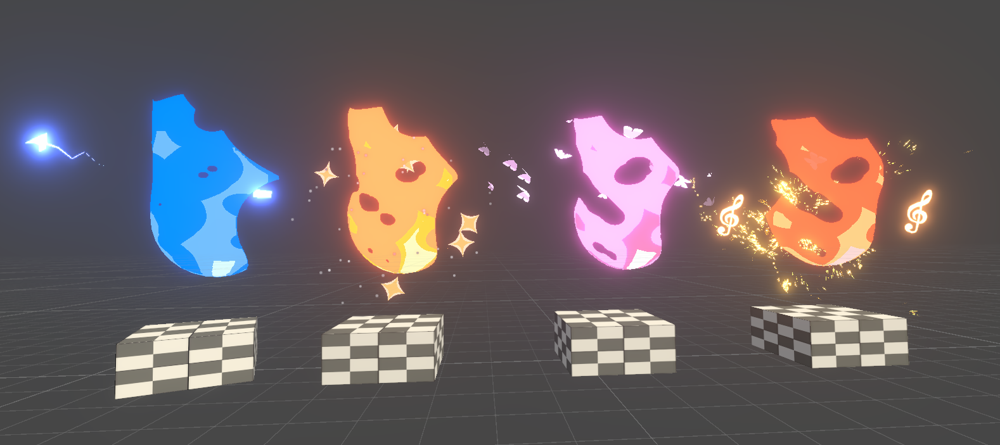

<!-- Main -->

<!-- Two -->
<section id="two" class="spotlights">
	<section>
		
		

			

				<header class="major">
					<h3>Stylized flame based on Unity shader graph</h3>
				</header>
				
This is a stylized flame effect made with Unity shader graph, producers can customize the range and color of different layers of the flame. This shader code can turn a simple black and white 2D texture into a vivid and glooming flame  with just a few clicks! 

				<ul class="actions">
					<li><a href="content/flame.html" class="button">Learn more</a></li>
				</ul>
			

		

	</section>
		<section>
		
		

			

				<header class="major">
					<h3>Oil Painting based on Blender Geometry Nodes</h3>
				</header>
				
This is oil Painting effect build with Blender Geometry Nodes, the materials is collected from famous artist Vincent Willem van Gogh's oil-painting work. This tool can directly apply oil-painting effect to object in Blender with no extra efforts in texturing and shading.

				<ul class="actions">
					<li><a href="content/oil.html" class="button">Learn more</a></li>
				</ul>
			

		

	</section>
	<!-- <section>
		
		

			

				<header class="major">
					<h3>Rhoncus magna</h3>
				</header>
				
Nullam et orci eu lorem consequat tincidunt vivamus et sagittis magna sed nunc rhoncus condimentum sem. In efficitur ligula tate urna. Maecenas massa sed magna lacinia magna pellentesque lorem ipsum dolor. Nullam et orci eu lorem consequat tincidunt. Vivamus et sagittis tempus.

				<ul class="actions">
					<li><a href="generic.html" class="button">Learn more</a></li>
				</ul>
			

		

	</section>
	<section>
		
		

			

				<header class="major">
					<h3>Sed nunc ligula</h3>
				</header>
				
Nullam et orci eu lorem consequat tincidunt vivamus et sagittis magna sed nunc rhoncus condimentum sem. In efficitur ligula tate urna. Maecenas massa sed magna lacinia magna pellentesque lorem ipsum dolor. Nullam et orci eu lorem consequat tincidunt. Vivamus et sagittis tempus.

				<ul class="actions">
					<li><a href="generic.html" class="button">Learn more</a></li>
				</ul>
			

		

	</section> -->
</section>

<!-- Three -->
<!-- <section id="three">
	

		<header class="major">
			<h2>Massa libero</h2>
		</header>
		
Nullam et orci eu lorem consequat tincidunt vivamus et sagittis libero. Mauris aliquet magna magna sed nunc rhoncus pharetra. Pellentesque condimentum sem. In efficitur ligula tate urna. Maecenas laoreet massa vel lacinia pellentesque lorem ipsum dolor. Nullam et orci eu lorem consequat tincidunt. Vivamus et sagittis libero. Mauris aliquet magna magna sed nunc rhoncus amet pharetra et feugiat tempus.

		<ul class="actions">
			<li><a href="generic.html" class="button next">Get Started</a></li>
		</ul>
	

</section> -->

