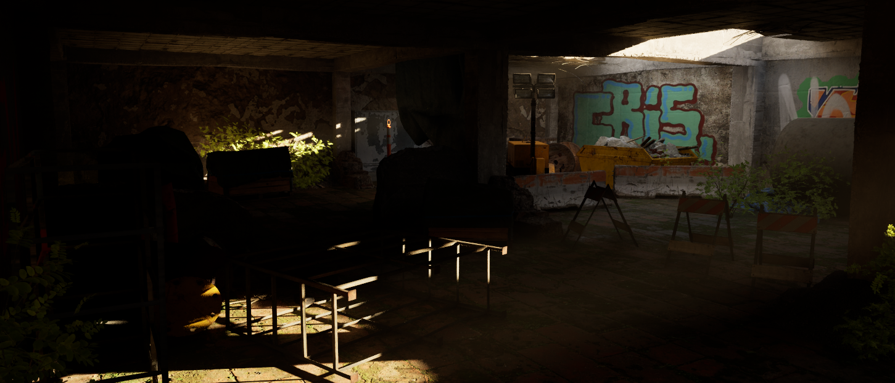

<!-- Main -->

<!-- Two -->
<section id="two" class="spotlights">
	<section>
		
		

			

				<header class="major">
					<h3>Environment Production with UE5</h3>
				</header>
				
This is a environmental production of an abandoned basement, using Unreal 5 and Quixel Bridge. Some K-frame Animation is also used for camera and character movement

				<ul class="actions">
					<li><a href="content/basement.html" class="button">Learn more</a></li>
				</ul>
			

		

	</section>
</section>

