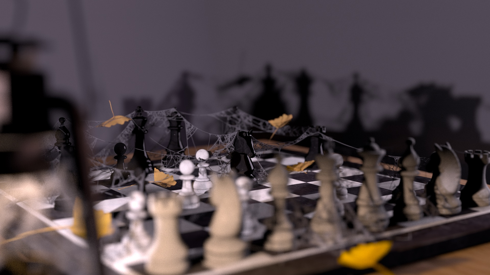
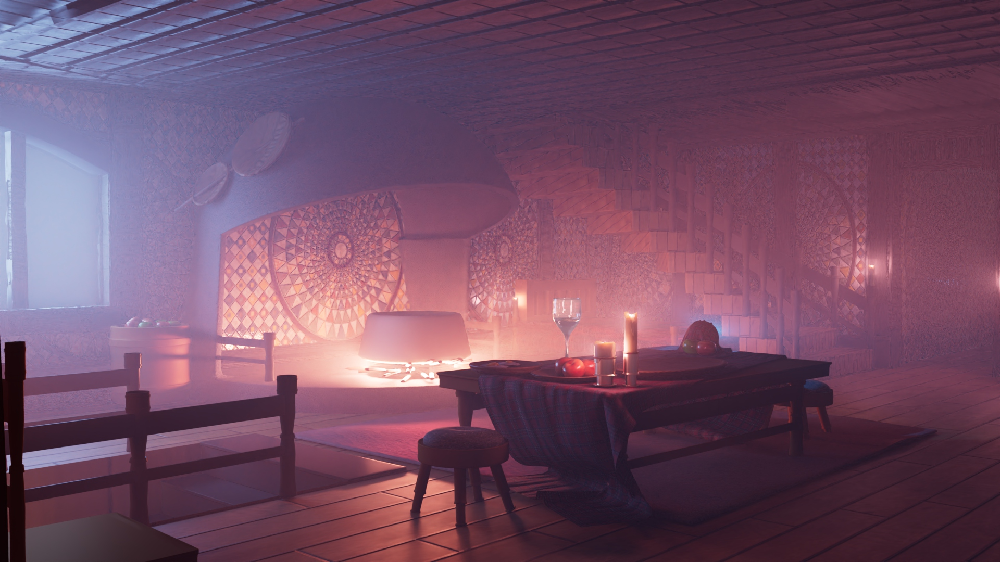
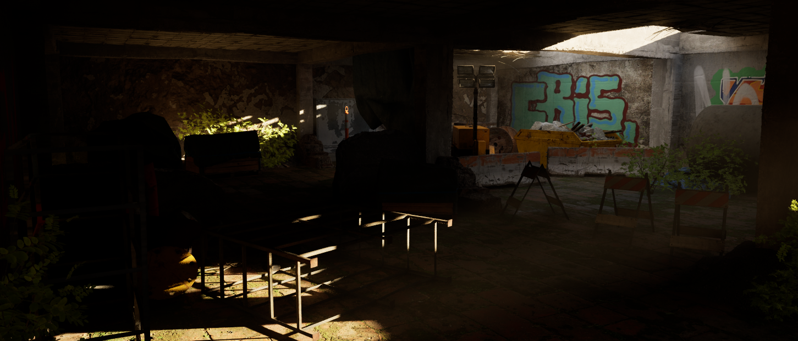
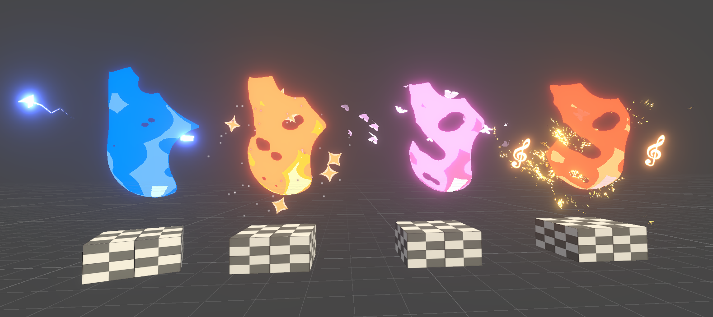
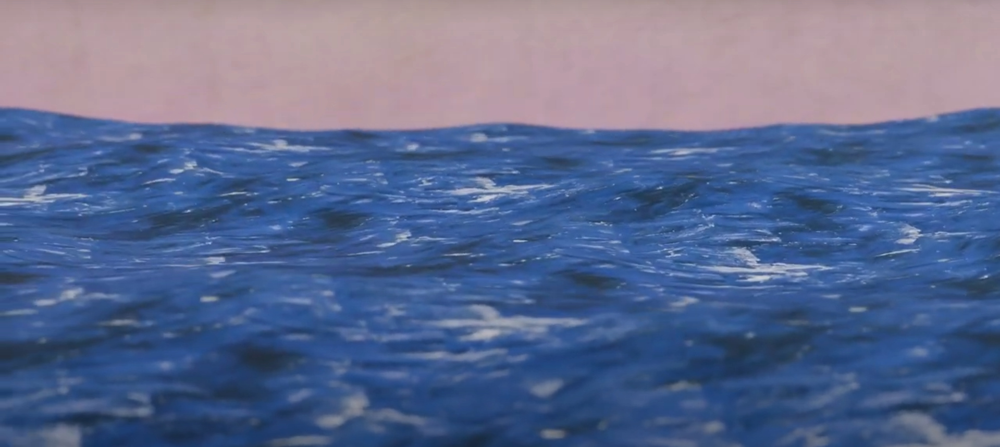

<!-- Projects -->
<section id="two" class="spotlights">
	<section>
		<a href="content/darts.html" class="image">
			
			<video src="assets/videos/darts_preview.mp4?v=1" muted loop playsinline preload="auto"></video>
		</a>
		

			

				<header class="major">
					<h3>Spectral Rendering Path Tracer</h3>
				</header>
				
A physically based path tracer built on Dartmouth's DARTS framework, featuring spectral rendering for dispersion, a custom plastic BSDF, Intel Open Image Denoise integration, multithreaded parallelization, and depth-of-field camera effects.

				<ul class="actions">
					<li><a href="content/darts.html" class="button">Learn more</a></li>
				</ul>
			

		

	</section>
	<section>
		<a href="content/howls-castle.html" class="image">
			
			<video src="assets/videos/howls_castle_preview.mp4?v=2" muted loop playsinline preload="auto"></video>
		</a>
		

			

				<header class="major">
					<h3>Howl's Moving Castle: Living Room</h3>
				</header>
				
A full recreation of the living room from Studio Ghibli's Howl's Moving Castle, hand-modeled entirely in Maya for a 3D Modeling course — from Calcifer's hearth to the mosaic-tiled walls and candlelit dining table.

				<ul class="actions">
					<li><a href="content/howls-castle.html" class="button">Learn more</a></li>
				</ul>
			

		

	</section>
	<section>
		<a href="content/basement.html" class="image">
			
			<video src="assets/videos/basement_preview.mp4?v=2" muted loop playsinline preload="auto"></video>
		</a>
		

			

				<header class="major">
					<h3>Environment Art in Unreal Engine 5</h3>
				</header>
				
An environment art piece of an abandoned basement, built in Unreal Engine 5 with Quixel Bridge assets, featuring basic keyframe animation for the camera and character.

				<ul class="actions">
					<li><a href="content/basement.html" class="button">Learn more</a></li>
				</ul>
			

		

	</section>
	<section>
		<a href="content/flame.html" class="image">
			
			<video src="assets/videos/flame_preview.mp4?v=2" muted loop playsinline preload="auto"></video>
		</a>
		

			

				<header class="major">
					<h3>Stylized Flame Shader in Unity</h3>
				</header>
				
A stylized flame effect built with Unity's Shader Graph. Artists can customize the range and color of each flame layer, turning a simple black-and-white texture into a vivid, glowing flame with just a few clicks.

				<ul class="actions">
					<li><a href="content/flame.html" class="button">Learn more</a></li>
				</ul>
			

		

	</section>
	<section>
		<a href="content/oil.html" class="image">
			
			<video src="assets/videos/oil_preview.mp4?v=2" muted loop playsinline preload="auto"></video>
		</a>
		

			

				<header class="major">
					<h3>Oil Painting Shader with Blender Geometry Nodes</h3>
				</header>
				
An oil-painting shader built with Blender's Geometry Nodes, using textures sourced from Vincent van Gogh's paintings. It applies a convincing oil-painting look to any object in Blender, with no extra texturing or shading work required.

				<ul class="actions">
					<li><a href="content/oil.html" class="button">Learn more</a></li>
				</ul>
			

		

	</section>
</section>

